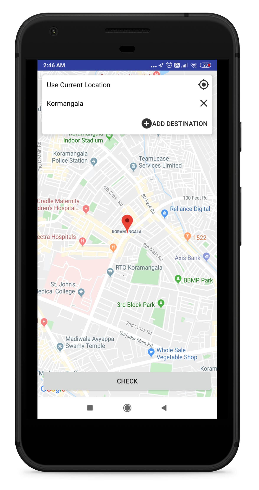
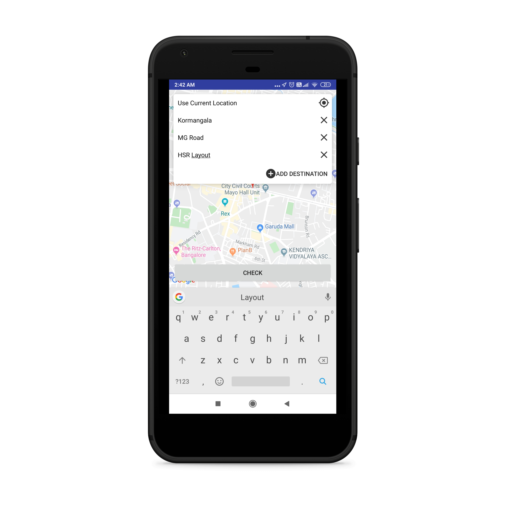
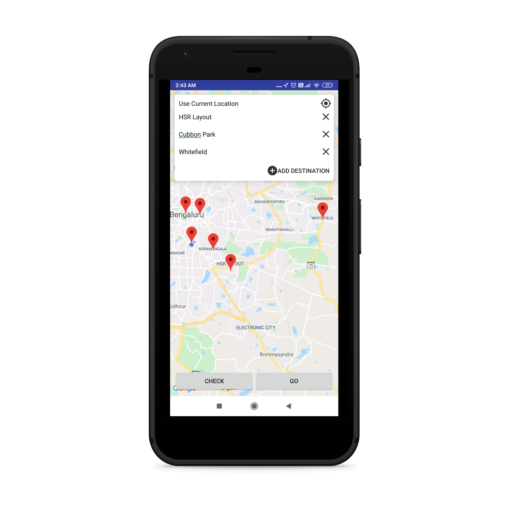
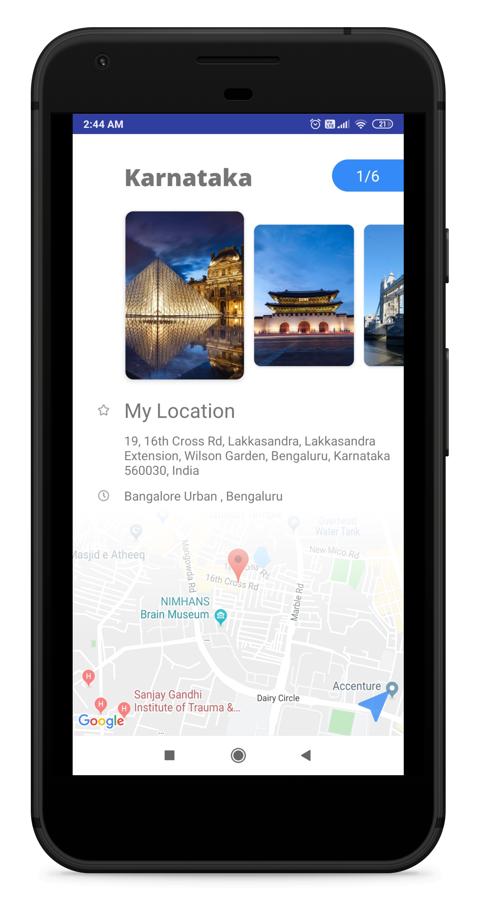
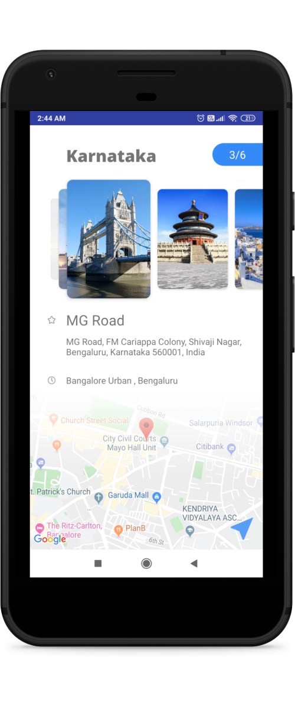
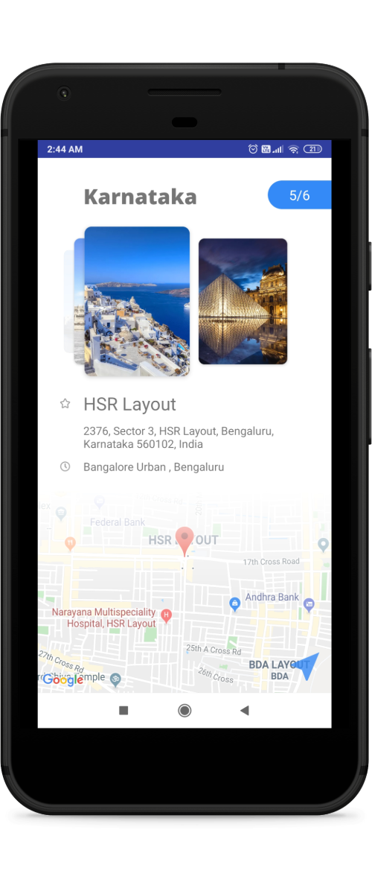

  
# TravNav  
  
#### __*TravNav finds the most optimised &amp; efficient route for your journey.*__  
  
  
  
### Motivation :muscle:    
There is no such software which will tell you the efficient route to reach multiple destinations.  
There is a wrong impression that Google Maps does it for you.  Google Maps only tell you the route for multiple destinations 
as provided by you sequentially. If you want to optimise the route, you have to manually check the distance between multiple 
destinations and calculate what's best for you.  
  
  
  
### TravNav Vs Google Maps :punch:   
For instance, You want to travel to 4 places ```(A, B, C, D)``` from Source S.  
In <b>Google Maps</b> App, you'll enter Source and add multiple destinations (A->B->C->D). Google Maps suggest you the route as 
entered by you in that same order ```(S->A->B->C->D)```. It won't optimise the route covering each destination in one shot.  
<b>TravNav</b> optimise your trip in such a way that the route will cover all the destinations in minimum distance. ```(S->B->D->C->A)```. 
  
  
  
### Description :ledger:    
TravNav is an android application designed for travellors and trip planners, which gives the best route for mutilpe destination that one wants to visit.  
It's solution is based on world class problem known as [Travelling Salesman Problem](https://simple.wikipedia.org/wiki/Travelling_salesman_problem).  
  
  
  
### How it works :question:  
1. Open the app, enter the source (by default, it is set to "Current Location").
2. Click on ```Add Destination buttion``` to add multiple destinations.  
3. Once you enter the source/destination, click on```Search button``` of your keypad to ensure entered location in the map.  
4. Once you entered all destinations, click on ```Check button``` to get a whole overview of all the places in the map.  
5. After that, Click on ```Go button```. TravNav calculate the optimised path for you & will render it rankwise (place to visit first).  
6. Click on ```Navigate button``` at rightmost bottom of the screen that will provide the path in the map via different travelling mediums.
  
  
  
### Development  
  
Want to contribute? **:pencil:**  
  
To fix a bug or enhance an existing module, follow these steps:  
  
1. Fork the repo
2. Create a new branch (`git checkout -b exciting-stuff`)
3. Add your google maps api key in [here](https://github.com/thegenuinegourav/TravNav/blob/master/app/src/main/res/values/strings.xml)
3. Make the appropriate changes in the files
4. Add changes to reflect the changes made
5. Commit your changes (`git commit -am 'exciting-stuff!!'`)
6. Push to the branch (`git push origin exciting-stuff`)
7. Create a Pull Request  
  
  
### Interested?  
  
If you find a bug (the app couldn't handle the query and / or gave irrelevant results), kindly open an issue [here](https://github.com/thegenuinegourav/TravNav/issues/new) by including your search query and the expected result.  
  
If you'd like to request a new functionality, feel free to do so by opening an issue [here](https://github.com/thegenuinegourav/TravNav/issues/new) including some sample queries and their corresponding results.  
  
  

### How to Build
* launch Android Studio
* select **Open an existing Android Studio project**
* select the project folder
* select menu **Run** -> **Run 'app'**  
  
  
  
### ScreenShots  
 
 
 
 
 

